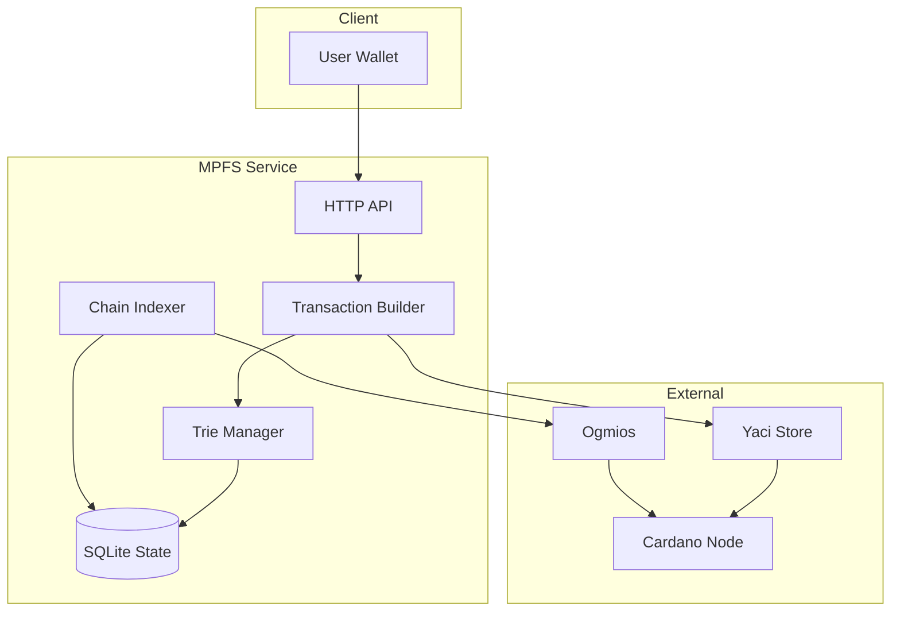

# Off-chain Code Documentation

The off-chain component is written in TypeScript and provides transaction building, chain indexing, and HTTP API services.

## Overview

The off-chain code consists of several modules:

- **Transaction Builders**: Functions to construct Cardano transactions
- **Indexer**: Tracks cage contract events on-chain
- **Trie Manager**: Manages local MPF state for proof generation
- **HTTP Service**: REST API for interacting with MPFS

## Module Structure

### Transaction Context (`transactions/context.ts`)

The `Context` type bundles all dependencies needed for transaction building:

```typescript
type Context = {
  cagingScript: { cbor, address, scriptHash, policyId };
  signingWallet: SigningWallet | undefined;
  addressWallet: (address: string) => Promise<WalletInfo>;
  newTxBuilder: () => MeshTxBuilder;
  fetchTokens: () => Promise<Token[]>;
  fetchToken: (tokenId: string) => Promise<CurrentToken | undefined>;
  fetchRequests: (tokenId: string | null) => Promise<Request[]>;
  trie: (tokenId: string, f: (trie: SafeTrie) => Promise<any>) => Promise<void>;
  waitBlocks: (n: number) => Promise<number>;
  tips: () => Promise<{ networkTip, indexerTip }>;
  waitSettlement: (txHash: string) => Promise<string>;
  pauseIndexer: () => Promise<() => void>;
  submitTx: (txHex: string) => Promise<string>;
  // ...
};
```

### Transaction Builders

#### Boot (`transactions/boot.ts`)

Creates a new MPF token:

```typescript
async function boot(context: Context): Promise<WithTxHash<string>>
```

- Mints a new token with unique ID (from spent UTxO)
- Creates State UTxO at cage address
- Initializes with null MPF root

#### Request (`transactions/request.ts`)

Submits a modification request:

```typescript
async function request(
  context: Context,
  tokenId: string,
  change: UnslottedChange
): Promise<WithTxHash<null>>
```

- Creates Request UTxO at cage address
- Locks 10 ADA (refundable)
- Contains operation details (insert/delete/update)

#### Update (`transactions/update.ts`)

Processes pending requests:

```typescript
async function update(
  context: Context,
  tokenId: string,
  requireds: OutputRef[] = []
): Promise<WithTxHash<string | null>>
```

- Spends State UTxO with Modify redeemer
- Spends selected Request UTxOs with Contribute redeemer
- Generates proofs by temporarily applying changes to local trie
- Produces new State UTxO with updated root

#### Retract (`transactions/retract.ts`)

Reclaims a pending request:

```typescript
async function retract(
  context: Context,
  requestOutputRef: OutputRef
): Promise<WithTxHash<null>>
```

- Spends Request UTxO with Retract redeemer
- Returns locked ADA to request owner

#### End (`transactions/end.ts`)

Destroys an MPF token:

```typescript
async function end(
  context: Context,
  tokenId: string
): Promise<WithTxHash<null>>
```

- Spends State UTxO with End redeemer
- Burns the token (mints -1)
- Requires owner signature

### Trie Management

#### Change Types (`trie/change.ts`)

```typescript
type UnslottedChange =
  | { type: 'insert'; key: string; newValue: string }
  | { type: 'delete'; key: string; oldValue: string }
  | { type: 'update'; key: string; oldValue: string; newValue: string };
```

#### SafeTrie (`trie/safeTrie.ts`)

Provides safe trie operations with rollback capability:

```typescript
type SafeTrie = {
  root: () => Uint8Array | null;
  get: (key: string) => Promise<string | null>;
  insert: (key: string, value: string) => Promise<Proof>;
  delete: (key: string, value: string) => Promise<Proof>;
  update: (key: string, oldValue: string, newValue: string) => Promise<Proof>;
  temporaryUpdate: (change: UnslottedChange) => Promise<Proof>;
  allFacts: () => Promise<Record<string, ValueSlotted>>;
  rollback: () => Promise<void>;
};
```

### Indexer

The indexer tracks on-chain events via Ogmios and maintains local state:

- **Tokens**: Tracks all MPF tokens and their current state
- **Requests**: Tracks pending modification requests
- **Events**: Processes block roll-forward/roll-back events

### HTTP Service

#### Signingless API

The production API that returns unsigned transactions:

| Endpoint | Method | Description |
|----------|--------|-------------|
| `/config` | GET | Service configuration |
| `/tokens` | GET | List all tokens |
| `/token/{tokenId}` | GET | Get token details |
| `/token/{tokenId}/facts` | GET | Get token facts |
| `/transaction/{address}/boot-token` | GET | Build boot transaction |
| `/transaction/{address}/request-insert/{tokenId}` | POST | Build insert request |
| `/transaction/{address}/request-update/{tokenId}` | POST | Build update request |
| `/transaction/{address}/request-delete/{tokenId}` | POST | Build delete request |
| `/transaction/{address}/update-token/{tokenId}` | GET | Build update transaction |
| `/transaction/{address}/retract-change/{outputRef}` | GET | Build retract transaction |
| `/transaction/{address}/end-token/{tokenId}` | GET | Build end transaction |
| `/transaction` | POST | Submit signed transaction |

## Architecture



## Key Patterns

### Proof Generation

When processing requests, the service:

1. Pauses the indexer to prevent state changes
2. Temporarily applies each change to the local trie copy
3. Captures the proof for each operation
4. Includes proofs in the Modify redeemer
5. Rolls back the trie after transaction is built

### Atomic Operations

The `pauseIndexer()` function ensures atomic operations:

```typescript
const release = await context.pauseIndexer();
try {
  // Perform operations
} finally {
  release();
}
```

### Transaction Submission

Uses Ogmios for reliable transaction submission with automatic retries.
