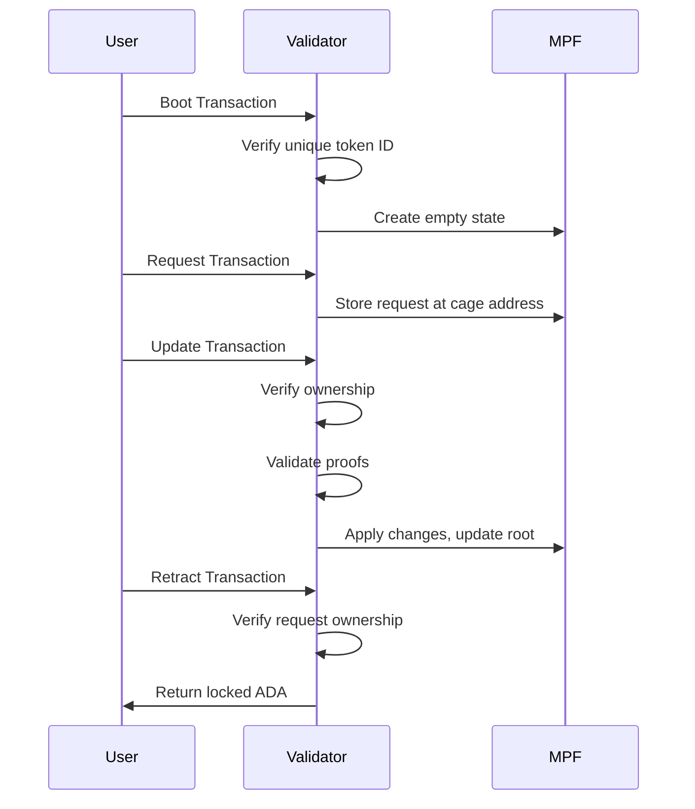

# On-chain Code Documentation

The on-chain component is written in [Aiken](https://aiken-lang.org/), a functional programming language designed for Cardano smart contracts.

## Overview

The cage smart contract manages MPF (Merkle Patricia Forestry) tokens on Cardano. It implements a "caging" pattern where tokens are locked at a script address with their MPF root stored in the datum.

## Module Structure

### `types.ak`

Defines the core data types used throughout the contract:

#### `Mint`
Represents the type of minting operation:
- `Boot` - Creates a new MPF token with an empty root
- `Destroy` - Burns an existing MPF token

#### `MintRedeemer`
Redeemer for minting policy validation:
```aiken
type MintRedeemer {
  Boot { token: TokenId }
  Destroy
}
```

#### `UpdateRedeemer`
Redeemer for spending validator (state updates):
```aiken
type UpdateRedeemer {
  proofs: List<Proof>
}
```

#### `State`
Represents the current state of an MPF token:
```aiken
type State {
  owner: ByteArray,  // Public key hash of the owner
  root: Hash<Blake2b_256, ByteArray>  // Current MPF root hash
}
```

#### `Operation`
Defines the operations that can be applied to an MPF:
```aiken
type Operation {
  Insert { new_value: ByteArray }
  Delete { old_value: ByteArray }
  Update { old_value: ByteArray, new_value: ByteArray }
}
```

#### `Request`
A pending modification request:
```aiken
type Request {
  tokenId: TokenId,     // Target token identifier
  owner: ByteArray,     // Request owner's pub key hash
  key: ByteArray,       // MPF key to modify
  operation: Operation  // The requested operation
}
```

#### `CageDatum`
The datum type for UTxOs at the cage address:
```aiken
type CageDatum {
  RequestDatum { request: Request }  // A pending request
  StateDatum { state: State }        // Token state
}
```

### `lib.ak`

Helper functions for token manipulation:

#### `quantity(value, policy, name)`
Extracts the quantity of a specific asset from a Value.

#### `assetName(value, policy)`
Retrieves the asset name of the first token found for a given policy.

#### `valueFromToken(policy, name, quantity)`
Creates a Value containing the specified token.

#### `tokenFromValue(value, policy)`
Extracts token information (name and quantity) from a Value.

#### `extractTokenFromInputs(inputs, policy)`
Finds and extracts a token from a list of transaction inputs.

### `cage.ak`

The main validator implementing both minting policy and spending validator.

## Minting Policy

The minting policy controls token creation and destruction:

### Boot (Minting)
When creating a new token:
1. The token ID must be unique (derived from a spent UTxO)
2. Exactly one token is minted
3. A new State UTxO is created at the cage address with:
   - The minted token
   - A null (empty) MPF root
   - The signer as the owner

### Destroy (Burning)
When destroying a token:
1. The token is burned (quantity: -1)
2. The owner must sign the transaction

## Spending Validator

The spending validator handles four cases based on the redeemer:

### End (ConStr0)
Terminates the token:
- Validates ownership
- Token is burned via the minting policy

### Contribute (ConStr1)
Spends a request UTxO in an update transaction:
- Verifies the referenced state UTxO is being consumed
- Part of batch request processing

### Modify (ConStr2)
Updates the MPF state:
- Validates ownership
- Verifies all proofs match the requests being consumed
- Computes the new root from applied operations
- Ensures the output contains the updated state

### Retract (ConStr3)
Allows request owners to reclaim their request UTxOs:
- Only the request owner can retract
- Returns the locked ADA

## Validation Flow



## Security Properties

1. **Ownership**: Only the token owner can modify or destroy the token
2. **Integrity**: All MPF modifications include cryptographic proofs
3. **Uniqueness**: Token IDs are derived from spent UTxOs, ensuring uniqueness
4. **Retractability**: Request owners can always reclaim their pending requests
