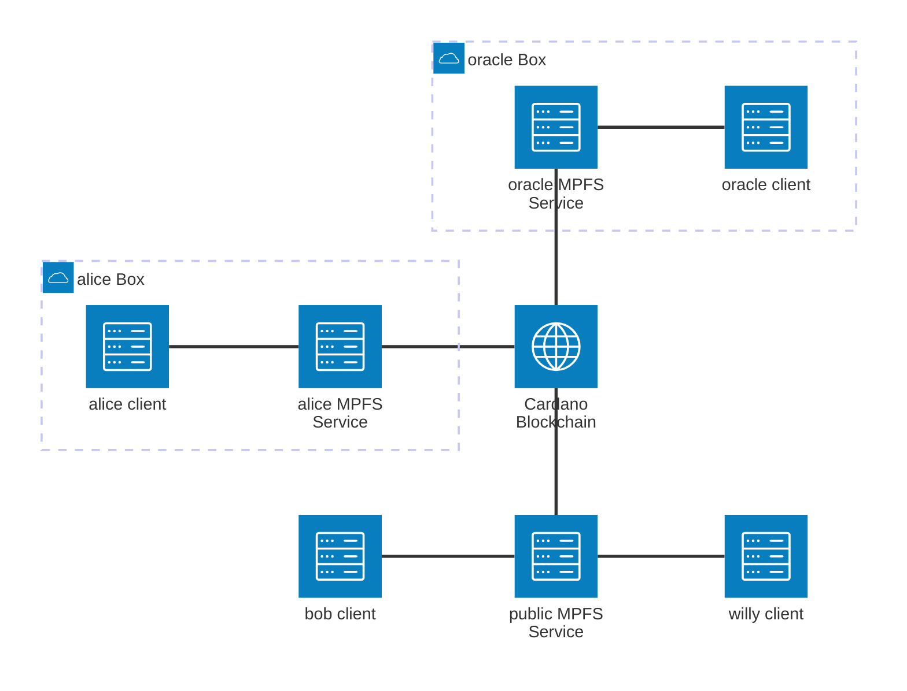
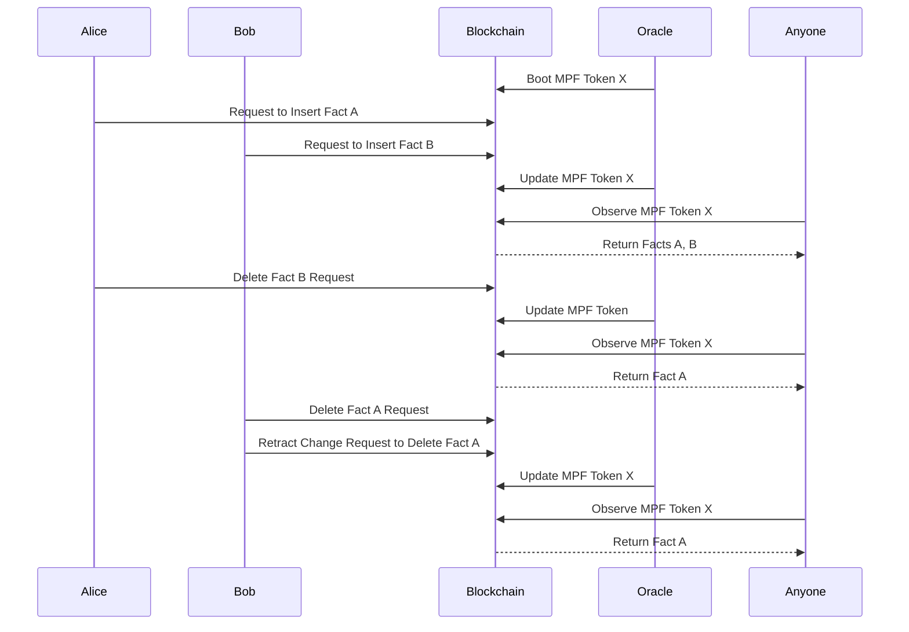

# System architecture

## Components

### MPF Token

The MPF token is a native token living on the Cardano blockchain. It is associated with a merkle trie root and the public key hash of the oracle controlling it.

### MPF Token facts

Facts are key-value pairs stored in the merkle trie associated with an MPF token. They represent the knowledge stored in the database.

## Parties

### Blockchain

The blockchain is used to store the state of the knowledge database and to validate operations on it.

### Oracle

Someone who controls which facts are part of an MPF token.

### Requester

Anyone who wants to change the facts in an MPF token.

### Observer

Anyone who needs to queries the knowledge database and/or use any fact as input to a smart contract.

## Overview

### Facts Storage

All knowledge is stored on the blockchain history, so it's reconstructable by anyone with access to it.
Moreover each of its facts are referrable as transaction inputs to be consumed in smart contracts as if they were stored in the current state of the blockchain.

### Token Ownership

The token owner (a.k.a. oracle) is the only one who can add or remove facts from the database. To do so he has to consume requests from requesters. In the current shape of the system, the oracle has full control over the facts, but in the future it could be possible to implement a more decentralized model where this power is distributed among multiple parties.

## Interaction

### MPF Token

We refer to the current state of the knowledge as the "MPF token". The token is the only value that is part of the blockchain state and it contains the hash of the current facts and the public key of the oracle controlling it.
All tokens are sitting at the system address which is determined by the smart contract controlling its identifier and its updating.

### Token Transactions

3 transactions are possible involving tokens

1. **Boot**: Anyone can become an oracle by creating a new MPF token. This token will be started with the null hash and be uniquely identified by an id, the token-id. The oracle will also set the public key of the oracle in the token.
2. **Update**: The oracle can update the MPF token by adding or removing facts from the database. This transaction will consume requests from contributorts and will update the knowledge hash in the token and potentially change the ownership of the token.
3. **End**: The oracle can delete the MPF token, which will remove the token-id, so no other updates can be applied on it. Future versions of this sytem will allow to use a deleted token knowledge hash as a starting point for a new MPF token, so the knowledge can be transferred in a new token without losing the history of the previous one.

### Change Requests

Facts contributors can send requests to the system address. They will be spent in one update token transaction of the token they are referring to. The request will contain the key and the value to be added or removed from the knowledge database as well as the token-id of the MPF token they wantt to be applied to.
The request will also contain the public key of the requester, so
- The request publisher can retract the request if needed.
- The oracle knows how to restitute part of the value that is locked in the request to the contributor.

3 Transactions are possible involving requests

1. **Request**: Anyone can create a request to add or remove knowledge from the database. The request will be stored in the blockchain state and can be consumed by the oracle in the update transaction.
2. **Retract**: The requester can retract the request in case the oracle does not accept it.
3. **Update**: This is the same transaction as the update of the MPF token, which consumes both a token and the requests that were targeting it.

### Smart contracts

A smart contrat is involved in `boot`, `update`, `end`, and `retract` transactions.
For each of these transactions, the smart contract will enforce rules to ensure the integrity of the knowledge database and the validity of the transactions.
- `boot`:
  - The new token-id is unique
  - The hash in the token is null (this is the hash of the knowledge database, implying an empty database)
- `update`:
  - All consumed change-requests have their referred token consumed as well
  - All requests are coupled with a proof that the update is actually performed to the knowledge database
  - The token remains at the system address
  - The token owner is the one who is performing the update
- `end`:
  - The token owner is the one who is performing the end
- `retract`:
  - The request publisher is the one who is performing the retract

## Protocol example

